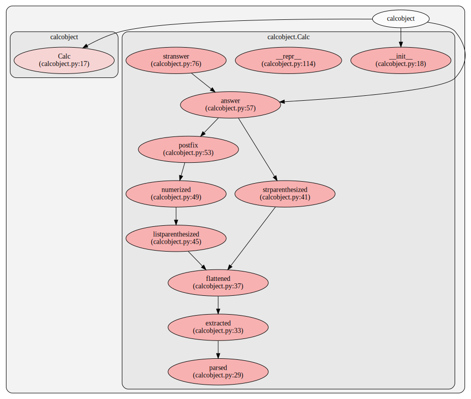

# `postfixcalc`

Simple, stupid but easy and powerful infix expression evaluator using [_postfix_](https://en.wikipedia.org/wiki/Reverse_Polish_notation) notation.

# User Guide

## How to use?


```python
from postfixcalc import Calc
```


```python
expr = "(-1) ^ 2 + 3 - 4 * 8 - 2 ^ 3"
calc = Calc(expr)
```


```python
print(calc.answer)
print(type(calc.answer))
```

    -36
    <class 'int'>


### Explanation
```
expression: (-1) ^ 2 + 3 - 4 * 8 - 2 ^ 3
```

which with the math operator precedence is:

```
expression: ((-1) ^ 2) + 3 - (4 * 8) - (2 ^ 3)
            = (1) + 3 - (32) - (8)
            = 4 - 32 - 8
            = -28 - 8
            = -36
```

## Initialization


```python
calc = Calc(
    '(2 ^ 32) ^ (2 ^ 15) + -1',
    calc_timeout=1,         # timeout for the calculation (in seconds)
    str_repr_timeout=1.5    # timeout to generate the string representation (in seconds)
)
```


```python
print(f"'(2 ^ 32) ^ (2 ^ 15) + -1's answer has '{len(calc.stranswer())}' digits")
```

    '(2 ^ 32) ^ (2 ^ 15) + -1's answer has '315653' digits


```python
print(f'answer is: {calc.stranswer(15, 15)}')
```

    answer is: 674114012549907...068940335579135


## Other Attributes


```python
from rich.pretty import Pretty
from rich import print as rprint
```


```python
rprint(calc.parsed)
```


<pre style="white-space:pre;overflow-x:auto;line-height:normal;font-family:Menlo,'DejaVu Sans Mono',consolas,'Courier New',monospace"><span style="font-weight: bold">&lt;</span><span style="color: #ff00ff; text-decoration-color: #ff00ff; font-weight: bold">ast.BinOp</span><span style="color: #000000; text-decoration-color: #000000"> object at </span><span style="color: #008080; text-decoration-color: #008080; font-weight: bold">0x7fb65c3917b0</span><span style="font-weight: bold">&gt;</span>
</pre>


```python
rprint(calc.extracted)
```


<pre style="white-space:pre;overflow-x:auto;line-height:normal;font-family:Menlo,'DejaVu Sans Mono',consolas,'Courier New',monospace"><span style="font-weight: bold">[</span>
    <span style="font-weight: bold">(</span>
        <span style="font-weight: bold">[</span>
            <span style="font-weight: bold">(</span>
                <span style="font-weight: bold">[([</span><span style="color: #008080; text-decoration-color: #008080; font-weight: bold">2</span><span style="font-weight: bold">]</span>, <span style="font-weight: bold">&lt;</span><span style="color: #ff00ff; text-decoration-color: #ff00ff; font-weight: bold">ast.Pow</span><span style="color: #000000; text-decoration-color: #000000"> object at </span><span style="color: #008080; text-decoration-color: #008080; font-weight: bold">0x7fb661991120</span><span style="font-weight: bold">&gt;</span>, <span style="font-weight: bold">[</span><span style="color: #008080; text-decoration-color: #008080; font-weight: bold">32</span><span style="font-weight: bold">])]</span>,
                <span style="font-weight: bold">&lt;</span><span style="color: #ff00ff; text-decoration-color: #ff00ff; font-weight: bold">ast.Pow</span><span style="color: #000000; text-decoration-color: #000000"> object at </span><span style="color: #008080; text-decoration-color: #008080; font-weight: bold">0x7fb661991120</span><span style="font-weight: bold">&gt;</span>,
                <span style="font-weight: bold">[([</span><span style="color: #008080; text-decoration-color: #008080; font-weight: bold">2</span><span style="font-weight: bold">]</span>, <span style="font-weight: bold">&lt;</span><span style="color: #ff00ff; text-decoration-color: #ff00ff; font-weight: bold">ast.Pow</span><span style="color: #000000; text-decoration-color: #000000"> object at </span><span style="color: #008080; text-decoration-color: #008080; font-weight: bold">0x7fb661991120</span><span style="font-weight: bold">&gt;</span>, <span style="font-weight: bold">[</span><span style="color: #008080; text-decoration-color: #008080; font-weight: bold">15</span><span style="font-weight: bold">])]</span>
            <span style="font-weight: bold">)</span>
        <span style="font-weight: bold">]</span>,
        <span style="font-weight: bold">&lt;</span><span style="color: #ff00ff; text-decoration-color: #ff00ff; font-weight: bold">ast.Add</span><span style="color: #000000; text-decoration-color: #000000"> object at </span><span style="color: #008080; text-decoration-color: #008080; font-weight: bold">0x7fb661990ee0</span><span style="font-weight: bold">&gt;</span>,
        <span style="font-weight: bold">[(&lt;</span><span style="color: #ff00ff; text-decoration-color: #ff00ff; font-weight: bold">ast.USub</span><span style="color: #000000; text-decoration-color: #000000"> object at </span><span style="color: #008080; text-decoration-color: #008080; font-weight: bold">0x7fb661991540</span><span style="font-weight: bold">&gt;</span>, <span style="font-weight: bold">[</span><span style="color: #008080; text-decoration-color: #008080; font-weight: bold">1</span><span style="font-weight: bold">])]</span>
    <span style="font-weight: bold">)</span>
<span style="font-weight: bold">]</span>
</pre>


```python
rprint(calc.flattened)
```


<pre style="white-space:pre;overflow-x:auto;line-height:normal;font-family:Menlo,'DejaVu Sans Mono',consolas,'Courier New',monospace"><span style="font-weight: bold">(</span>
    <span style="font-weight: bold">(</span>
        <span style="font-weight: bold">(([</span><span style="color: #008080; text-decoration-color: #008080; font-weight: bold">2</span><span style="font-weight: bold">]</span>, <span style="font-weight: bold">&lt;</span><span style="color: #ff00ff; text-decoration-color: #ff00ff; font-weight: bold">ast.Pow</span><span style="color: #000000; text-decoration-color: #000000"> object at </span><span style="color: #008080; text-decoration-color: #008080; font-weight: bold">0x7fb661991120</span><span style="font-weight: bold">&gt;</span>, <span style="font-weight: bold">[</span><span style="color: #008080; text-decoration-color: #008080; font-weight: bold">32</span><span style="font-weight: bold">])</span>,<span style="font-weight: bold">)</span>,
        <span style="font-weight: bold">&lt;</span><span style="color: #ff00ff; text-decoration-color: #ff00ff; font-weight: bold">ast.Pow</span><span style="color: #000000; text-decoration-color: #000000"> object at </span><span style="color: #008080; text-decoration-color: #008080; font-weight: bold">0x7fb661991120</span><span style="font-weight: bold">&gt;</span>,
        <span style="font-weight: bold">(([</span><span style="color: #008080; text-decoration-color: #008080; font-weight: bold">2</span><span style="font-weight: bold">]</span>, <span style="font-weight: bold">&lt;</span><span style="color: #ff00ff; text-decoration-color: #ff00ff; font-weight: bold">ast.Pow</span><span style="color: #000000; text-decoration-color: #000000"> object at </span><span style="color: #008080; text-decoration-color: #008080; font-weight: bold">0x7fb661991120</span><span style="font-weight: bold">&gt;</span>, <span style="font-weight: bold">[</span><span style="color: #008080; text-decoration-color: #008080; font-weight: bold">15</span><span style="font-weight: bold">])</span>,<span style="font-weight: bold">)</span>
    <span style="font-weight: bold">)</span>,
    <span style="font-weight: bold">&lt;</span><span style="color: #ff00ff; text-decoration-color: #ff00ff; font-weight: bold">ast.Add</span><span style="color: #000000; text-decoration-color: #000000"> object at </span><span style="color: #008080; text-decoration-color: #008080; font-weight: bold">0x7fb661990ee0</span><span style="font-weight: bold">&gt;</span>,
    <span style="font-weight: bold">(&lt;</span><span style="color: #ff00ff; text-decoration-color: #ff00ff; font-weight: bold">ast.USub</span><span style="color: #000000; text-decoration-color: #000000"> object at </span><span style="color: #008080; text-decoration-color: #008080; font-weight: bold">0x7fb661991540</span><span style="font-weight: bold">&gt;</span>, <span style="font-weight: bold">[</span><span style="color: #008080; text-decoration-color: #008080; font-weight: bold">1</span><span style="font-weight: bold">])</span>
<span style="font-weight: bold">)</span>
</pre>


```python
rprint(calc.strparenthesized)
```


<pre style="white-space:pre;overflow-x:auto;line-height:normal;font-family:Menlo,'DejaVu Sans Mono',consolas,'Courier New',monospace"><span style="font-weight: bold">(((</span><span style="color: #008080; text-decoration-color: #008080; font-weight: bold">2</span> ^ <span style="color: #008080; text-decoration-color: #008080; font-weight: bold">32</span><span style="font-weight: bold">))</span> ^ <span style="font-weight: bold">((</span><span style="color: #008080; text-decoration-color: #008080; font-weight: bold">2</span> ^ <span style="color: #008080; text-decoration-color: #008080; font-weight: bold">15</span><span style="font-weight: bold">)))</span> + <span style="font-weight: bold">(</span><span style="color: #008080; text-decoration-color: #008080; font-weight: bold">-1</span><span style="font-weight: bold">)</span>
</pre>


```python
rprint(calc.listparenthesized)
```


<pre style="white-space:pre;overflow-x:auto;line-height:normal;font-family:Menlo,'DejaVu Sans Mono',consolas,'Courier New',monospace"><span style="font-weight: bold">[</span><span style="color: #008000; text-decoration-color: #008000">'('</span>, <span style="color: #008000; text-decoration-color: #008000">'('</span>, <span style="color: #008000; text-decoration-color: #008000">'('</span>, <span style="color: #008080; text-decoration-color: #008080; font-weight: bold">2</span>, <span style="color: #008000; text-decoration-color: #008000">'^'</span>, <span style="color: #008080; text-decoration-color: #008080; font-weight: bold">32</span>, <span style="color: #008000; text-decoration-color: #008000">')'</span>, <span style="color: #008000; text-decoration-color: #008000">')'</span>, <span style="color: #008000; text-decoration-color: #008000">'^'</span>, <span style="color: #008000; text-decoration-color: #008000">'('</span>, <span style="color: #008000; text-decoration-color: #008000">'('</span>, <span style="color: #008080; text-decoration-color: #008080; font-weight: bold">2</span>, <span style="color: #008000; text-decoration-color: #008000">'^'</span>, <span style="color: #008080; text-decoration-color: #008080; font-weight: bold">15</span>, <span style="color: #008000; text-decoration-color: #008000">')'</span>, <span style="color: #008000; text-decoration-color: #008000">')'</span>, <span style="color: #008000; text-decoration-color: #008000">')'</span>, <span style="color: #008000; text-decoration-color: #008000">'+'</span>, <span style="color: #008000; text-decoration-color: #008000">'('</span>, <span style="color: #008000; text-decoration-color: #008000">'-1'</span>, <span style="color: #008000; text-decoration-color: #008000">')'</span><span style="font-weight: bold">]</span>
</pre>


```python
rprint(calc.numerized)
```


<pre style="white-space:pre;overflow-x:auto;line-height:normal;font-family:Menlo,'DejaVu Sans Mono',consolas,'Courier New',monospace"><span style="font-weight: bold">[</span><span style="color: #008000; text-decoration-color: #008000">'('</span>, <span style="color: #008000; text-decoration-color: #008000">'('</span>, <span style="color: #008000; text-decoration-color: #008000">'('</span>, <span style="color: #008080; text-decoration-color: #008080; font-weight: bold">2</span>, <span style="color: #008000; text-decoration-color: #008000">'^'</span>, <span style="color: #008080; text-decoration-color: #008080; font-weight: bold">32</span>, <span style="color: #008000; text-decoration-color: #008000">')'</span>, <span style="color: #008000; text-decoration-color: #008000">')'</span>, <span style="color: #008000; text-decoration-color: #008000">'^'</span>, <span style="color: #008000; text-decoration-color: #008000">'('</span>, <span style="color: #008000; text-decoration-color: #008000">'('</span>, <span style="color: #008080; text-decoration-color: #008080; font-weight: bold">2</span>, <span style="color: #008000; text-decoration-color: #008000">'^'</span>, <span style="color: #008080; text-decoration-color: #008080; font-weight: bold">15</span>, <span style="color: #008000; text-decoration-color: #008000">')'</span>, <span style="color: #008000; text-decoration-color: #008000">')'</span>, <span style="color: #008000; text-decoration-color: #008000">')'</span>, <span style="color: #008000; text-decoration-color: #008000">'+'</span>, <span style="color: #008000; text-decoration-color: #008000">'('</span>, <span style="color: #008080; text-decoration-color: #008080; font-weight: bold">-1</span>, <span style="color: #008000; text-decoration-color: #008000">')'</span><span style="font-weight: bold">]</span>
</pre>


```python
rprint(calc.postfix)
```


<pre style="white-space:pre;overflow-x:auto;line-height:normal;font-family:Menlo,'DejaVu Sans Mono',consolas,'Courier New',monospace"><span style="font-weight: bold">[</span><span style="color: #008080; text-decoration-color: #008080; font-weight: bold">2</span>, <span style="color: #008080; text-decoration-color: #008080; font-weight: bold">32</span>, <span style="color: #008000; text-decoration-color: #008000">'^'</span>, <span style="color: #008080; text-decoration-color: #008080; font-weight: bold">2</span>, <span style="color: #008080; text-decoration-color: #008080; font-weight: bold">15</span>, <span style="color: #008000; text-decoration-color: #008000">'^'</span>, <span style="color: #008000; text-decoration-color: #008000">'^'</span>, <span style="color: #008080; text-decoration-color: #008080; font-weight: bold">-1</span>, <span style="color: #008000; text-decoration-color: #008000">'+'</span><span style="font-weight: bold">]</span>
</pre>


```python
rprint(f'{calc.stranswer(15, 15)}')
```


<pre style="white-space:pre;overflow-x:auto;line-height:normal;font-family:Menlo,'DejaVu Sans Mono',consolas,'Courier New',monospace"><span style="color: #008080; text-decoration-color: #008080; font-weight: bold">674114012549907</span><span style="color: #808000; text-decoration-color: #808000">...</span><span style="color: #008080; text-decoration-color: #008080; font-weight: bold">068940335579135</span>
</pre>


# `Calc` Documentation

**`class Calc`** _`(expr: str, calc_timeout: int | float = 0.1, str_repr_timeout: int | float = 0.2)`_

- `expr`: _infix_ math expression

- `calc_timeout`: the timeout of the math calculation, if a expression's calculation took longer than this time, it would be killed and a `TimeoutError` will be raised.

- `str_repr_timeout`: Calculating a expression like: `(2 ^ 32) ^ (2 ^ 15)` takes about a seconds, but the result has 315653 digits; so printing (getting the string representation) takes some time, this timeout is controlled by this parameter; and a `TimeoutError` will be raised.

### Properties of `Calc`

#### Important Note

All the properties of `Calc` type (except `stranswer`) are [cached properties](https://docs.python.org/3/library/functools.html#functools.cached_property). It means that they are calculated once and stored in the object and are not calculated every time you need them (if other properties and attributes are remained unchanged)

- `Calc.parsed`

Parse the object with `ast.parse` function and return the parsed expression.
Because `ast.parse` uses the grammar of Python any syntax error will be raised here!


```python
# underlying function

from postfixcalc.parser import parse

expr = '-1 ^ 2'
parsed = parse(expr)

rprint(parsed)
```


<pre style="white-space:pre;overflow-x:auto;line-height:normal;font-family:Menlo,'DejaVu Sans Mono',consolas,'Courier New',monospace"><span style="font-weight: bold">&lt;</span><span style="color: #ff00ff; text-decoration-color: #ff00ff; font-weight: bold">ast.UnaryOp</span><span style="color: #000000; text-decoration-color: #000000"> object at </span><span style="color: #008080; text-decoration-color: #008080; font-weight: bold">0x7fb6603566b0</span><span style="font-weight: bold">&gt;</span>
</pre>


- `Calc.extracted`

Return a list of extracted numbers and operators from the [parsed object](https://docs.python.org/3/library/ast.html?highlight=ast#ast.Expr)


```python
# underlying function
from postfixcalc.parser import extract_nums_and_ops

extracted = extract_nums_and_ops(parsed)
rprint(extracted)
```


<pre style="white-space:pre;overflow-x:auto;line-height:normal;font-family:Menlo,'DejaVu Sans Mono',consolas,'Courier New',monospace"><span style="font-weight: bold">[(&lt;</span><span style="color: #ff00ff; text-decoration-color: #ff00ff; font-weight: bold">ast.USub</span><span style="color: #000000; text-decoration-color: #000000"> object at </span><span style="color: #008080; text-decoration-color: #008080; font-weight: bold">0x7fb661991540</span><span style="font-weight: bold">&gt;</span>, <span style="font-weight: bold">[([</span><span style="color: #008080; text-decoration-color: #008080; font-weight: bold">1</span><span style="font-weight: bold">]</span>, <span style="font-weight: bold">&lt;</span><span style="color: #ff00ff; text-decoration-color: #ff00ff; font-weight: bold">ast.Pow</span><span style="color: #000000; text-decoration-color: #000000"> object at </span><span style="color: #008080; text-decoration-color: #008080; font-weight: bold">0x7fb661991120</span><span style="font-weight: bold">&gt;</span>, <span style="font-weight: bold">[</span><span style="color: #008080; text-decoration-color: #008080; font-weight: bold">2</span><span style="font-weight: bold">])])]</span>
</pre>


- `Calc.flattened`

Flatten the numbers and operators list, this will reduce the nested lists and tuples


```python
# underlying function
from postfixcalc.parser import flatten_nodes

flattened = flatten_nodes(extracted)
rprint(flattened)
```


<pre style="white-space:pre;overflow-x:auto;line-height:normal;font-family:Menlo,'DejaVu Sans Mono',consolas,'Courier New',monospace"><span style="font-weight: bold">(&lt;</span><span style="color: #ff00ff; text-decoration-color: #ff00ff; font-weight: bold">ast.USub</span><span style="color: #000000; text-decoration-color: #000000"> object at </span><span style="color: #008080; text-decoration-color: #008080; font-weight: bold">0x7fb661991540</span><span style="font-weight: bold">&gt;</span>, <span style="font-weight: bold">([</span><span style="color: #008080; text-decoration-color: #008080; font-weight: bold">1</span><span style="font-weight: bold">]</span>, <span style="font-weight: bold">&lt;</span><span style="color: #ff00ff; text-decoration-color: #ff00ff; font-weight: bold">ast.Pow</span><span style="color: #000000; text-decoration-color: #000000"> object at </span><span style="color: #008080; text-decoration-color: #008080; font-weight: bold">0x7fb661991120</span><span style="font-weight: bold">&gt;</span>, <span style="font-weight: bold">[</span><span style="color: #008080; text-decoration-color: #008080; font-weight: bold">2</span><span style="font-weight: bold">]))</span>
</pre>


- `Calc.strparenthesized`

Generate a _parenthesized_ version of the expression passed in initialization according to the math operator precedence


```python
# underlying function
from postfixcalc.parser import restrexpression

rprint(restrexpression(flattened))
```


<pre style="white-space:pre;overflow-x:auto;line-height:normal;font-family:Menlo,'DejaVu Sans Mono',consolas,'Courier New',monospace">-<span style="font-weight: bold">(</span><span style="color: #008080; text-decoration-color: #008080; font-weight: bold">1</span> ^ <span style="color: #008080; text-decoration-color: #008080; font-weight: bold">2</span><span style="font-weight: bold">)</span>
</pre>


- `Calc.listparenthesized`

Return the digits and parenthesis and operators in a list that will be used to generate the postfix list


```python
# underlying function
from postfixcalc.parser import relistexpression

listed = relistexpression(flattened)
rprint(listed)
```


<pre style="white-space:pre;overflow-x:auto;line-height:normal;font-family:Menlo,'DejaVu Sans Mono',consolas,'Courier New',monospace"><span style="font-weight: bold">[</span><span style="color: #008000; text-decoration-color: #008000">'-'</span>, <span style="color: #008000; text-decoration-color: #008000">'('</span>, <span style="color: #008080; text-decoration-color: #008080; font-weight: bold">1</span>, <span style="color: #008000; text-decoration-color: #008000">'^'</span>, <span style="color: #008080; text-decoration-color: #008080; font-weight: bold">2</span>, <span style="color: #008000; text-decoration-color: #008000">')'</span><span style="font-weight: bold">]</span>
</pre>


- `Calc.numerized`

Numerize the string numbers returned by `listparenthesized` method. In some cased like: `(-1) ^ 2)` the `listparenthesized` looks like this: `['(', '-1', ')', '^', 2]`, so we have to make those strings numbers


```python
# underlying function
from postfixcalc.parser import make_num

numerized = make_num(listed)
rprint(numerized)
```


<pre style="white-space:pre;overflow-x:auto;line-height:normal;font-family:Menlo,'DejaVu Sans Mono',consolas,'Courier New',monospace"><span style="font-weight: bold">[</span><span style="color: #008000; text-decoration-color: #008000">'-'</span>, <span style="color: #008000; text-decoration-color: #008000">'('</span>, <span style="color: #008080; text-decoration-color: #008080; font-weight: bold">1</span>, <span style="color: #008000; text-decoration-color: #008000">'^'</span>, <span style="color: #008080; text-decoration-color: #008080; font-weight: bold">2</span>, <span style="color: #008000; text-decoration-color: #008000">')'</span><span style="font-weight: bold">]</span>
</pre>


- `Calc.postfix`

Return a list with the postfix notation of the expression


```python
# underlying function
from postfixcalc.parser import infix_to_postfix

postfixed = infix_to_postfix(numerized)
rprint(postfixed)
```


<pre style="white-space:pre;overflow-x:auto;line-height:normal;font-family:Menlo,'DejaVu Sans Mono',consolas,'Courier New',monospace"><span style="font-weight: bold">[</span><span style="color: #008080; text-decoration-color: #008080; font-weight: bold">1</span>, <span style="color: #008080; text-decoration-color: #008080; font-weight: bold">2</span>, <span style="color: #008000; text-decoration-color: #008000">'^'</span>, <span style="color: #008000; text-decoration-color: #008000">'-'</span><span style="font-weight: bold">]</span>
</pre>


- `Calc.answer`

Calculate the answer respecting the `calc_timeout`

**IMPORTANT NOTE: DON'T CALL `print` ON THE RESULT OF THIS METHOD.**

This is because for instance calculating `(2 ^ 32) ^ (2 ^ 15)` is done under `calc_timeout` BUT generating the string
representation **WILL TAKE MUCH LONGER!!!** (it has 315653 digits)

If you want to `print` the result, use `stranswer` method

method
```python
@cached_property
def answer(self):
    process = multiprocessing.Process(target=evaluate, args=(self.postfix,))
    process.start()
    process.join(timeout=self.calc_timeout)
    if process.is_alive():
        process.terminate()
        raise TimeoutError(
            f"Calculations of {self.strparenthesized!r} took longer than {self.calc_timeout} seconds",
        ) from None
    return evaluate(self.postfix)
```


```python
# underlying function
from postfixcalc.pyeval import evaluate

rprint(evaluate(postfixed))
```


<pre style="white-space:pre;overflow-x:auto;line-height:normal;font-family:Menlo,'DejaVu Sans Mono',consolas,'Courier New',monospace"><span style="color: #008080; text-decoration-color: #008080; font-weight: bold">-1</span>
</pre>


- `Calc.stranswer`

Return the string representation of the `Calc.answer` respecting the `str_repr_timeout`

method

```python
def stranswer(
    self,
    beginning: Optional[int] = None,
    ending: Optional[int] = None,
) -> str:
    """Return the string representation of the answer with the respect to the `str_repr_timeout`

    beginning: see the first n digits of the answer: '982734...'
    ending: see the last n digits of the answer: '...982734'

    if both are specified: '987234...873242'
    """
    process = multiprocessing.Process(target=str, args=(self.answer,))
    process.start()
    process.join(self.str_repr_timeout)
    if process.is_alive():
        process.terminate()
        raise TimeoutError(
            f"Generating a string representation of {self.expr!r} took longer than {self.str_repr_timeout} seconds",
        ) from None
    try:
        answer = str(self.answer)
        match (beginning, ending):
            case (None, None):
                return answer
            case (x, None):
                return f"{answer[:x]}..."
            case (None, x):
                return f"...{answer[-x:]}"
            case (x, y):
                return f"{answer[:x]}...{answer[-y:]}"
            case _:
                raise ValueError("Confusing beginning and ending")
    except ValueError:
        raise TimeoutError(
            f"Generating a string representation of {self.expr!r} took longer than {self.str_repr_timeout} seconds",
        ) from None
```

### How the answer is calculated

`Calc` type has cached properties which rely on each others returned values, it means that when we access the `Calc.answer` property this sequential method and function calls, happen:


`print(calc.answer)`
  1. `calc.answer` needs the postfix: `calc.postfix` gets called
  2. `calc.postfix` needs the numerized list of the digits and operators: `calc.numerized` gets called
  3. `calc.numerized` needs the parenthesized list of the digits and operators: `calc.listparenthsized` gets called
  4. `calc.listprenthesized` needs the flattened list of extracted nums and ops: `calc.flattened` gets called.
  5. `calc.flattened` needs the extracted nums and ops: `calc.extracted` gets called.
  6. `calc.extracted` needs the parsed expression of the input expression: `calc.parsed` gets called.

### Call graph for getting the answer


